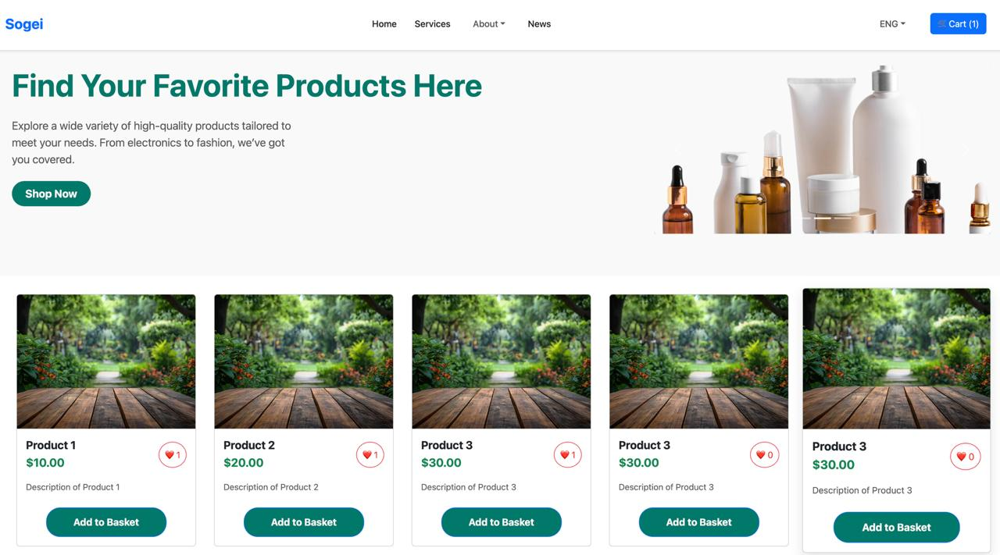

# React.js E-Commerce Frontend

## Overview
This is a beginner-friendly frontend for a modern E-Commerce Platform, built using React.js and Vite. The application provides a user-friendly shopping experience with essential features like product browsing, cart management, and checkout.

## Technologies Used

### Core Technologies
- **Vite** - Fast build tool for modern JavaScript applications.
- **React** - Component-based JavaScript library for building user interfaces.
- **React DOM** - Efficient UI updates using a virtual DOM.
- **JavaScript (ES6+)** - Modern JavaScript features for better development experience.

### Styling & UI Frameworks
- **Bootstrap** - Pre-built UI components for responsive design.
- **Tailwind CSS** - Utility-first CSS framework for styling.
- **CSS Modules** - Scoped styling to avoid conflicts.

### Routing & APIs
- **React Router DOM** - Enables seamless navigation between pages.
- **REST APIs** - Fetch and send data between frontend and backend.

## Features
- **Modern UI & UX** - Designed with accessibility and responsiveness in mind.
- **Product Listing** - Browse available products.
- **Shopping Cart** - Add items to the cart and view selected products.
- **Checkout Modal** - Enter payment details and complete the order.
- **Optimized Performance** - Uses Vite for fast builds and efficient loading.

## Setup & Installation

### 2️⃣ Install Dependencies
```sh
npm install  # or yarn install
```

### 3️⃣ Run the Development Server
```sh
npm run dev  # or yarn dev
```
The application will be available at `http://localhost:5173/`


### Home Page

